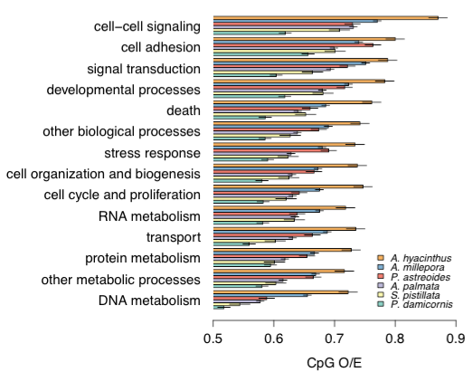

<!ANNOTATION RESULTS NEED TO GO FIRST>>

_**Predicted Gene Methylation**_    

<!FIRST SENTENCE DOES NOT SAY ANYTHING>>
Whole transcriptome patterns of predicted germline DNA methylation were similar for all coral species (Figure 1).

<!DO NOT START SENTENCE WITH STATS SAY>>
 Log likelihood statistics for all species indicated that a 2-component Gaussian mixture model provided a better fit to the distribution than a unimodal fit. All CpG O/E distributions were characterized by a relatively small low-CpG O/E component and a larger high-CpG O/E component. 

 
For all six species, the top four biological processes with the highest mean CpG O/E were cell-cell signalling, cell adhesion, signal transduction, and developmental processes (Figure 2). In contrast, DNA metabolism, protein metabolism, transport, and other biological processes were consistently among the lowest categories in terms of CpG O/E (Figure 2)

<!FIGURE DOES NOT WORK-- TRY SOMETHING ELSE>>

In *Acropora hyacinthus*, *A. millepora*, and *A. palmata*, genes expressed differentially in response to environmental stress showed different CpG O/E distributions than those of the whole transcriptomes (Figure 3). In all cases, mean CpG O/E of differentially expressed genes was higher than that of the whole transcriptome. This was especially true for genes differentially expressed in response to thermal stress in *A. hyacinthus* and *A. palmata* (both p < 0.001). Differences between CpG O/E distributions of OA response genes and the whole transcriptome of *A. millepora* were more subtle (p = 0.03).
